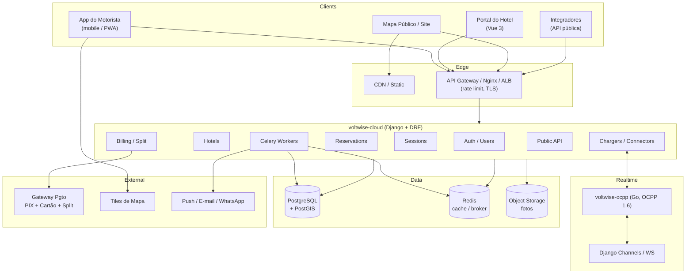
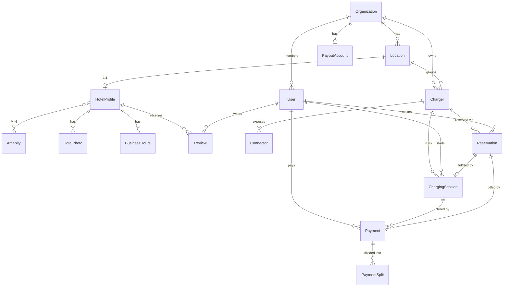
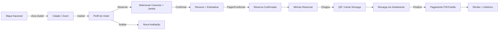

# VoltWise — Rede de Recarga para Hotelaria

Arquitetura e plano de produto para evoluir a VoltWise de uma plataforma de gestão
OCPP para uma **rede pública de recarga focada em hotelaria**.

Este documento é o blueprint dos 8 sistemas solicitados. A fundação de backend
(modelos, serviços e APIs) já está implementada em `voltwise-cloud` nos apps
`hotels`, `reservations`, `billing` e na extensão de `chargers` (`Connector`).

---

## 1. Visão geral da arquitetura



**Decisões-chave**

- O backend canônico continua sendo **voltwise-cloud** (Django 5 + DRF + PostgreSQL),
  já multi-tenant por `Organization`.
- **PostGIS** entra para consultas geoespaciais (bounding box, raio, "perto de mim").
- **Redis** para cache de status de carregador (mapa de baixa latência) e broker Celery.
- **Celery** para tarefas assíncronas: expiração de reservas, no-show, webhooks,
  liquidação de splits, e-mails/push.
- Integração de pagamento atrás de uma camada de serviço (`billing/services.py`) para
  trocar de PSP sem tocar o domínio.

---

## 2. Modelagem do banco de dados

### 2.1 Diagrama de entidades



### 2.2 Entidades (resumo dos campos relevantes)

| Entidade | Campos principais | Observações |
|---|---|---|
| **Location** | name, latitude, longitude, organization | Base geográfica; ganha PostGIS `PointField` na fase 2. |
| **HotelProfile** | location(1:1), slug, display_name, description, endereço completo, phone, whatsapp, email, website, amenities(M:N), rating_avg/count, is_published | Perfil público do hotel. |
| **Amenity** | name, slug, icon, category | Catálogo de comodidades. |
| **HotelPhoto** | hotel, image_url, caption, order, is_cover | Fotos do hotel. |
| **BusinessHours** | hotel, weekday, opens_at, closes_at, is_closed, is_24h | Horários. |
| **Review** | hotel, author, session, rating(1-5), comment, is_verified, is_approved | "verificada" quando atrelada a sessão real. |
| **Charger** | name, identifier, status, location, kwh_price, connection_fee, idle_fee, **is_reservable**, **is_public** | `status` ganhou `reserved`. |
| **Connector** | charger, ocpp_connector_id, standard(ccs2/type2/...), current_type(ac/dc), max_power_kw, status, is_free, price_per_kwh, price_per_minute | Granularidade dos filtros do mapa. |
| **Reservation** | driver, charger, connector, start_time, end_time, grace_minutes, status, price_estimate, session, confirmed_at, cancelled_at | Máquina de estados + controle de conflito. |
| **ChargingSession** | charger, user, transaction_id, start_time, end_time, energy_kwh, battery_soc, fully_charged_at, status | Já existente; idle_cost calculado. |
| **PayoutAccount** | organization(1:1), gateway_account_id, hotel_share_percent, is_verified | Conta de recebível do hotel. |
| **Payment** | driver, organization, session, reservation, method(pix/card/wallet), status, breakdown (energy/time/idle/reservation), gross_amount, gateway_fee, gateway_charge_id, pix_qr_code | Cobrança. |
| **PaymentSplit** | payment, recipient_type(hotel/platform/gateway), organization, percent, amount, is_settled | Divisão automática. |

### 2.3 Regras e integridade

- **Conflito de reserva**: nenhuma reserva *bloqueante* (`pending/confirmed/active`) pode
  se sobrepor na mesma `Charger` (validado com `SELECT ... FOR UPDATE` no serviço).
- **Status do carregador**: `available → reserved` quando a janela inicia; volta a
  `available` quando nenhuma reserva bloqueante está ativa.
- **Split soma 100%**: `gateway_fee` sai do topo; o líquido divide-se entre hotel
  (`hotel_share_percent`) e plataforma.
- **Uma sessão ativa por carregador** (regra já existente, mantida).

---

## 3. APIs REST

Prefixo `/api/`. JWT (Bearer) exceto endpoints públicos (`AllowAny`).

### 3.1 Público (mapa, busca, perfil) — sem autenticação

```
GET  /api/public/hotels/                 Lista/busca (?city= ?state= ?q=)
GET  /api/public/hotels/map/             Markers (?bbox=minLng,minLat,maxLng,maxLat)
GET  /api/public/hotels/{slug}/          Perfil completo + chargers + reviews
GET  /api/public/hotels/{slug}/reviews/  Avaliações paginadas
GET  /api/public/availability/?charger=&start_time=&end_time=
```

Filtros do mapa (combináveis): `current_type=ac,dc`, `standard=ccs2,type2`,
`price=free|paid`, `reservable=true`, `status=available`.

### 3.2 API pública para integradores (fase 6)

```
GET  /api/v1/stations/            Estações + conectores + preços
GET  /api/v1/stations/{id}/availability?from=&to=
GET  /api/v1/prices/
```
Autenticação por **API Key** (OAuth2 client-credentials), quota e rate-limit por chave.

### 3.3 Motorista (autenticado)

```
POST   /api/reservations/                Criar (auto-confirma; 409 em conflito)
GET    /api/reservations/                Minhas reservas
POST   /api/reservations/{id}/cancel/    Cancelar
DELETE /api/reservations/{id}/           Cancelar
GET    /api/payments/                    Histórico financeiro do motorista
POST   /api/public/hotels/{slug}/reviews/create/
```

### 3.4 Hotel / Dashboard (autenticado, org-scoped)

```
GET/PUT  /api/manage/hotels/             Editar perfil público
GET      /api/manage/payments/           Histórico financeiro
GET      /api/manage/payments/summary/   Receita líquida + a liquidar
GET      /api/manage/dashboard/?days=30  KPIs: energia, receita, sessões, ranking
CRUD     /api/chargers/                  Carregadores (existente)
```

### 3.5 Webhook do gateway (a implementar)

```
POST /api/billing/webhooks/{provider}/   Reconciliação de pagamento (HMAC)
```

---

## 4. Casos de uso

| # | Ator | Caso de uso | Fluxo resumido |
|---|---|---|---|
| UC1 | Visitante | Encontrar hotel no mapa | `map/?bbox` + filtros → clusters → marker → perfil |
| UC2 | Visitante | Ver perfil do hotel | `/public/hotels/{slug}/` (fotos, comodidades, horários, conectores, avaliações) |
| UC3 | Motorista | Reservar vaga | escolhe janela → checa `availability` → `POST /reservations` (auto-confirma) → carregador `reserved` |
| UC4 | Motorista | Cancelar reserva | `cancel` → estado→cancelled → libera carregador |
| UC5 | Motorista | Iniciar recarga (QR) | OCPP `StartTransaction` → vincula reserva ativa → sessão |
| UC6 | Sistema | Cobrar pós-recarga | `StopTransaction` → `build_session_payment` (energia+tempo+idle) → PIX/cartão |
| UC7 | Sistema | Split automático | webhook `paid` → `compute_splits` → hotel + comissão + taxa gateway |
| UC8 | Motorista | Avaliar | `reviews/create` → verificada se houve sessão concluída |
| UC9 | Hotel | Ver dashboard | `manage/dashboard` (receita, energia, utilização, ranking) |
| UC10 | Integrador | Consultar disponibilidade | `GET /v1/stations/{id}/availability` |
| UC11 | Sistema | No-show / expiração | Celery libera carregador após `grace_minutes` |

---

## 5. Fluxos de tela



**App do motorista** (fase 6): Cadastro/Login · Mapa & Busca · Favoritos · Reservas ·
Histórico/Pagamentos · Navegação (deep-link Google/Apple/Waze) · Perfil.

**Dashboard do hotel**: Visão geral (KPIs) · Carregadores · Reservas (calendário) ·
Financeiro (extrato + split) · Perfil público (editor) · Ranking de ocupação.

---

## 6. Estrutura de permissões

| Papel | Escopo | Permissões |
|---|---|---|
| **Anônimo** | público | mapa, busca, perfis, disponibilidade |
| **Driver** (`user.role=driver`) | próprio | reservas, pagamentos, avaliações, favoritos |
| **Hotel Manager** (`role=admin` + `organization`) | sua organização | chargers, perfil, dashboard, financeiro |
| **Hotel Owner** (`organization.owner`) | sua organização | tudo do manager + `PayoutAccount`, convites |
| **Integrador** | API Key | endpoints `/v1/` (leitura) |
| **Internal Service** | `X-Internal-Api-Key` | endpoints OCPP `/internal/` |
| **Staff/Admin** | global | Django admin |

Isolamento multi-tenant mantido na camada de `get_queryset()` (filtra por
`request.user.organization`) e em `IsOrganizationMember`.

---

## 7. Estratégia de escalabilidade

- **Stateless + JWT**: API escala horizontalmente atrás do ALB sem sticky session.
- **Cache de status no Redis**: leituras do mapa (status de conector) servidas do cache,
  invalidadas por evento OCPP — protege o PostgreSQL de leituras quentes.
- **PostGIS + índices geoespaciais (GiST)**: consultas por bounding box / raio em O(log n).
- **Read replicas**: relatórios e dashboard usam réplica de leitura.
- **Celery**: expiração de reservas, no-show, webhooks, liquidação e notificações fora do request.
- **Particionamento futuro**: `charging_sessions` e `payments` por data (alto volume).
- **Concorrência de reservas**: `SELECT ... FOR UPDATE` no carregador evita double-booking.
- **CDN** para fotos (object storage) e bundle do portal.
- **Rate limiting** por IP (público) e por API Key (integradores).

---

## 8. Roadmap priorizado

| Fase | Entrega | Itens | Status |
|---|---|---|---|
| **F0 — Fundação de dados** | Modelos e APIs base | `Connector`, `HotelProfile`, `Reservation`, `Payment`/`Split`, APIs públicas | ✅ implementado neste repo |
| **F1 — Mapa & Perfil** | Mapa público + página do hotel | PostGIS, clusterização no front, filtros, editor de perfil no portal | próximo |
| **F2 — Reservas** | Reserva ponta-a-ponta | UI de janela, auto-confirmação, Celery (expiração/no-show), bloqueio OCPP | |
| **F3 — Pagamento & Split** | Cobrança real | Integração PSP (PIX+cartão+split), webhook, recibos, extrato | |
| **F4 — Dashboard do hotel** | Analytics | gráficos de receita/energia/utilização, ranking, exportação | |
| **F5 — App do motorista** | Mobile/PWA | cadastro, favoritos, reservas, pagamentos, navegação | |
| **F6 — API pública** | Integradores | API Keys, OAuth2 client-credentials, quotas, OpenAPI/Swagger | |
| **F7 — Hardening** | Escala & confiabilidade | cache Redis, read replicas, particionamento, observabilidade | |

**Sequência crítica**: F0 → F1 → F2 → F3 são o caminho de valor mínimo viável da rede
(achar → reservar → recarregar → pagar com split). F4–F7 ampliam alcance e robustez.

---

## 9. O que já foi implementado (voltwise-cloud)

```
apps/chargers/    + Connector, ChargerStatus.RESERVED, Charger.is_reservable/is_public, is_free
apps/hotels/      HotelProfile, Amenity, HotelPhoto, BusinessHours, Review
                  + API pública (mapa, busca, perfil, reviews) e gestão org-scoped
apps/reservations/ Reservation (máquina de estados + conflito), services, API do motorista,
                  endpoint público de disponibilidade
apps/billing/     PayoutAccount, Payment, PaymentSplit, services (build_session_payment,
                  compute_splits, mark_paid), histórico do motorista e do hotel, dashboard
config/           apps registrados em INSTALLED_APPS e rotas em config/urls.py
```

**Próximos passos técnicos**: `python manage.py makemigrations` + `migrate`; adicionar
PostGIS ao `Location`; tasks Celery de expiração/no-show; adapter do PSP e webhook;
telas no `voltwise-portal`.
